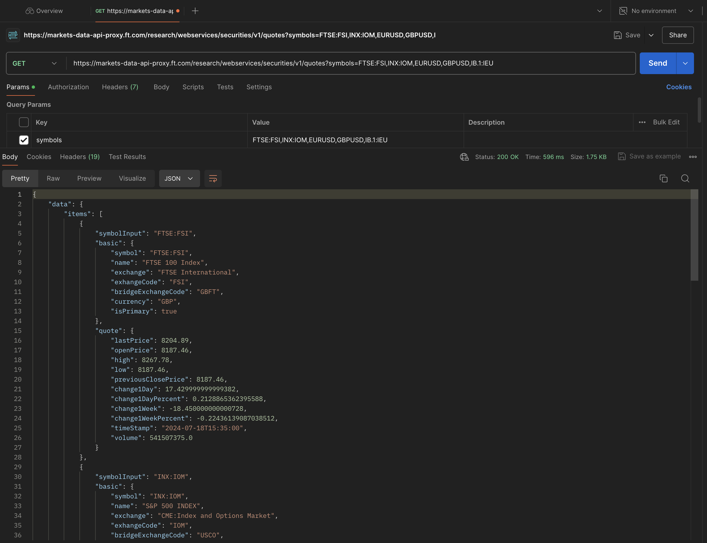
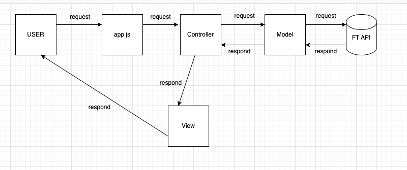

# Financial Times Technical Test

The test is in two parts. Please create a branch to do your work and tell us when you have finished your work so we can review your branch. Do both exercises in the branch.

We expect that this exercise should take about 90 minutes. This is a guideline, not a fixed limit. Don’t feel rushed to complete the exercise, but work on it as and when you have time.

You can either do both exercises at home, or pick one to send in and do the other as a pairing exercise with us during the technical interview.

We do not have a preference in terms of the way you choose to complete the technical test and we do not factor your choice into our hiring decision. We offer the choice because some candidates find pairing exercise interviews prohibitively nerve-wracking and we want you to be able to show us thought-process for writing software, not how well you cope under extreme pressure.

You can build the templates in either JSX or Handlebars, depending on your preference.

## OPTION 1 - AT HOME:

Please do both exercises before sending in. Remember, you don’t have to do it all in one sitting.

## OPTION 2 - PART AT HOME, PART PAIRING:

Please do one of the exercises before sending in, and we will do the other exercise as a pairing exercise.

For the at home section, we recommend picking the exercise that plays to your strengths and is most relevant to the role you are interested in (e.g. if you are applying for a role where the job description states that most of the work is client-side, build the UI).

## Exercise: Retrieve the data

Use the [securities quotes api](#using-our-securities-quotes-api) (also known as stock prices) to get the data for the items below and output the results in plain HTML.

## Exercise: Build the UI

Build the component in the design below. If you are doing this one at home and the other part pairing in the office, you can use this [sample JSON](test/fixtures/securities-response.json).

The project must have:

- tests. We don't expect comprehensive tests, we would like to see what you can do
- documentation. We don't expect comprehensive documentation, we would like to see what you think is important to document
- error handling

The project could:

- Be responsive
- Be accessible
- Not be reliant on client-side frameworks (i.e. Angular, React) or libraries like jQuery
- Built using Javascript and node.js
- Use Origami Components
- Be progressively enhanced
- Have a similar look and feel as ft.com
- Perform well over 3G networks

Please specify in your submission which one of these points you have addressed and how (e.g. in the `README` of your submission repo) along with documentation, testing, or any other aspects you consider relevant.

## Prerequisites

Running this project requires [Node.js](https://nodejs.org/en/) 18.x or greater, and [npm](https://www.npmjs.com/).

## Getting started

1. Clone this repository to your machine.
1. Install the dependencies with `npm install`.
1. Start the app with `npm start`. Any changes you make will be automatically updated.
   - Used JSX? http://localhost:3000/jsx
   - Used Handlebars? http://localhost:3000/handlebars
1. Run tests with `npm test`.
1. Make changes to the template code by editing either `views/handlebars/home.handlebars` or `views/jsx/Components/Home.jsx` depending on whether you prefer using Handlebars or JSX, and for client-side code `src/styles.scss` and `src/main.js` for CSS and JS.
   - [Handlebars quick guide](#Handlebars)
1. For any server-side code you write, start in `app.js`.

## Using our Securities Quotes API

To fetch the day's percentage change for a security you can use our Securities Quotes API.

### HTTP Request

`GET https://markets-data-api-proxy.ft.com/research/webservices/securities/v1/quotes`

### URL Query Parameters

| Parameter | Description                                                                                                                                                                               |
| --------- | ----------------------------------------------------------------------------------------------------------------------------------------------------------------------------------------- |
| `symbols` | Any valid [symbol](Symbols) for a security, or a comma-separated list of [symbols](Symbols), e.g. for the FTSE 100, use `FTSE:FSI`. For the FTSE 100 and S&P 500, use `FTSE:FSI,INX:IOM`. |

### Symbols

We would like you to display the information from the following symbols (these are the securities we show on the [FT.com front page](https://www.ft.com) 📰).

| Security        | Symbol     |
| --------------- | ---------- |
| FTSE 100        | `FTSE:FSI` |
| S&P 500         | `INX:IOM`  |
| Euro/Dollar     | `EURUSD`   |
| Pound/Dollar    | `GBPUSD`   |
| Brent Crude Oil | `IB.1:IEU` |

## Handlebars

Handlebars is a simple templating language.

We have set this test up to allow you to use either JSX or Handlebars. You can use a different templating language if you prefer, but you will need to add it.

Here is a quick guide that should cover all the bits you need:

OUTPUT data passed to the template

- Data passed in:

      {name: "testUser123"}

- Handlebars template:
  Hi {{name}}
- Output:
  Hi testUser123

Also supports dot notation for passing in more complex objects

- Data passed in:
  {user: {name: "testUser123"}}
- Handlebars template:
  Hi {{user.name}}
- Output:
  Hi testUser123

Alternatively

- Data passed in:
  {user: {name: "testUser123"}}
- Handlebars template:
  {{#with user}}{{name}}{{/with}}
- Output:
  Hi testUser123

ITERATION

- Data passed in:
  {fruit: ["apples", "pears", "oranges"]}
- Handlebars template:
  {{#each fruit}}-{{this}}- {{/fruit}}
- Output:
  -apples- -pears- -oranges-

CONDITIONALS

- Data passed in:
  {isLoggedIn: true}
- Handlebars template:
  {{#if isLoggedIn}} My account {{else}} Log in {{/if}} -
  {{#unless isLoggedIn}} Register {{else}} Logged in {{/unless}}
- Output:
  My account - Logged in

Full docs: https://handlebarsjs.com/guide/

## My Approach - Robin Winters -

- Send Request to FT Markets Data API: I first sent a request to the FT Markets Data API to view the output via Postman.
  

In this tech test, the goal is to display specific information from the market stocks API response. Specifically, we need to extract and show only the name and change1DayPercent values for each stock. Additionally, we need to format the name as shown on the FT website, adjust the color of the change1DayPercent value based on whether it's positive or negative, and round change1DayPercent to two decimal places.

- This is my Graph:
  

As it has been seen from the graph, I follow the Model-View-Controller (MVC) architecture to reach my goal.
I will write as many unit tests as I can to demonstrate my testing skills and create several classes to showcase my OOP (Object-Oriented Programming) skills. For the UI, I aim to create a pixel-perfect, responsive, progressive, and accessible application, as shown in the above picture which shows an example securities data component. I will also generate JSDoc documentation for classes and methods details.

### Step1)

- Create an ApiUrl model. This model should be reusable, meaning it can accept any URL and parameters and successfully retrieve and format the data.
- Create a separate helper method for formatting each item of data, which can be used within the class when instances are created.
- Create Custom Error to handle errors.
- Write unit test for model, helper method and errors.

### Step 2)

- Create a Data Controller: The data controller getMarketData method is responsible for fetching and formatting market data from an FT Market API. It first checks for the required environment variables (FT_MARKET_API_URL and FT_MARKET_SYMBOLS) and throwing a ValidationError if either is missing or wrong. If there is not any issue data controller communicate with ApiModel to fetch the data and format it before returning the formatted data. In case of any errors during the process, it handles them using the handleError function.
- Create a .env file to store information Api Url, Symbols and also Port values. NORMALLY this file should not be pushed to Github. But because of this is a tech test in case of cloning repo and running directly it will be pushed to Github this time.
- Write Unit Test for Data Controller
